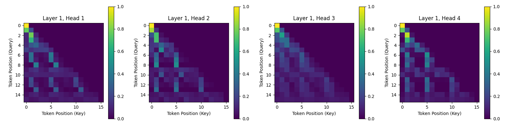

# Simple LLM Training with GPT-2 Architecture

This repository demonstrates how to train a Language Learning Model (LLM) from scratch using the GPT-2 architecture. The model is trained on numerical sequences to learn and predict patterns.

## 📌 Overview

This project implements a full machine learning pipeline:

- 📊 **Synthetic dataset generation** (number sequences)
- 🔤 **Custom tokenizer training**
- 🧠 **Model training** using GPT-2
- 🤖 **Inference capabilities**

---

## 🚧 Progress So Far

✅ We have trained a **6.4 million parameter** model that:
- Uses **base-16 (hexadecimal)** conversion for tokenization.
- Can **add up to 4-digit numbers with 100% accuracy**.
- Is publicly available on Hugging Face:  
  🔗 [mirajnair/simple-llm-gpt2-v1.0](https://huggingface.co/mirajnair/simple-llm-gpt2-v1.0)

---

## 🏗️ Dataset Generator

Synthetic number sequences are generated based on parameters defined in `data_config.yaml`.

**Example Configuration:**
- **Number range:** `0 - 9999`
- **Number of sequences:** `100,000`
- **Output path:** `../simple-llm-data/sequences.txt`
- **Delimiters:** `|` (columns), `\n` (rows)

### 🔧 To Generate the Dataset:
1. Update `data_config.yaml` with your desired parameters.
2. Run the generator:
   ```bash
   python3 data_generator.py
   ```

---

## 🎯 Training

### Step 1: Train the Tokenizer
```bash
python3 tokenizer.py
```

### Step 2: Train the Model
```bash
python3 trainer.py
```

Training configurations are managed in `train_config.yaml`, including:

- 🔧 Model architecture (layers, heads, embedding size)
- ⚙️ Training hyperparameters (batch size, learning rate)
- 💾 Checkpointing and saving
- ☁️ Hugging Face Hub integration

---

## 🔢 Position Embeddings

### 📐 Learnable vs. Sinusoidal Embeddings

- **Learnable Embeddings**: Adapt to numeric patterns.
- **Sinusoidal Embeddings**: Provide a mathematical basis for position understanding.

---

### 🧮 Block Position IDs (Abacus Embedding)

Inspired by the [Abacus Embedding paper](https://arxiv.org/pdf/2405.17399), we use **block position IDs**.

**Example:**

- Input:     `+1342+879+2221+`
- Block IDs: `012340123012340`

#### 🔍 Why Block Position IDs?

1. ✅ **Commutative Support**: `a + b = b + a` — block IDs reinforce this.
2. 🧠 **Digit Alignment**: Helps align units, tens, hundreds positions for easier digit-wise processing.

---

### 🔄 Digit Reversal

As part of preprocessing:
- `5672 → 2765` (reversed)
- Output is reversed back during evaluation.

#### 📈 Benefits of Reversal

1. 🧒 **Human-like learning**: Mimics the left-to-right addition humans use.
2. 🎯 **Causal attention compatibility**: Enables better carryover handling.

---

## 🧩 Tokenization Strategy

Tokenization is **critical** for arithmetic modeling. Our approach:

1. 📏 **Shortens sequences**: Optimizes context window usage.
2. 🧬 **Boosts generalization**: Learns across number patterns.
3. 🔄 **Uses base conversion** (e.g., decimal → hexadecimal) for compact, arithmetic-aware tokens.
4. 🧠 **Preserves arithmetic logic**: Even in higher bases, rules still apply.

_We’re experimenting with different bases to improve efficiency further._

---

## 🔁 Multi-token Prediction

Predicting **multiple tokens at once** increases efficiency.

### Example:

```
Input (reversed):     +12+873+993+PPPP      (P = padding tokens)
Output (reversed):    PPPPPP993+PPPPPP      (P = padding tokens)
Position IDs:         0120123012300000
```

We're currently supporting **2-token prediction** and working on expanding this method.
```


## 📊 Attention Visualization

Visualizing attention patterns reveals how the model processes arithmetic operations. Below is an example showing attention patterns for the addition problem: `101 + 1002 = 1103` (represented in reversed form as `+101+:2001+:3011+`).

### Layer 1 Attention Patterns



In this visualization:
- **Bright vertical bars** at positions 1, 5, and 10 show how the model focuses on unit digits from both inputs and the output
- The model learns to align corresponding digit positions (units with units, tens with tens, etc.)
- Attention patterns reveal how information flows during the addition process, including carry operations

This confirms our block position ID approach helps the model understand the commutative nature of addition and properly align digits for arithmetic operations.

The visualization demonstrates how the model has learned to focus on relevant digits when performing calculations, similar to how humans process arithmetic problems.

